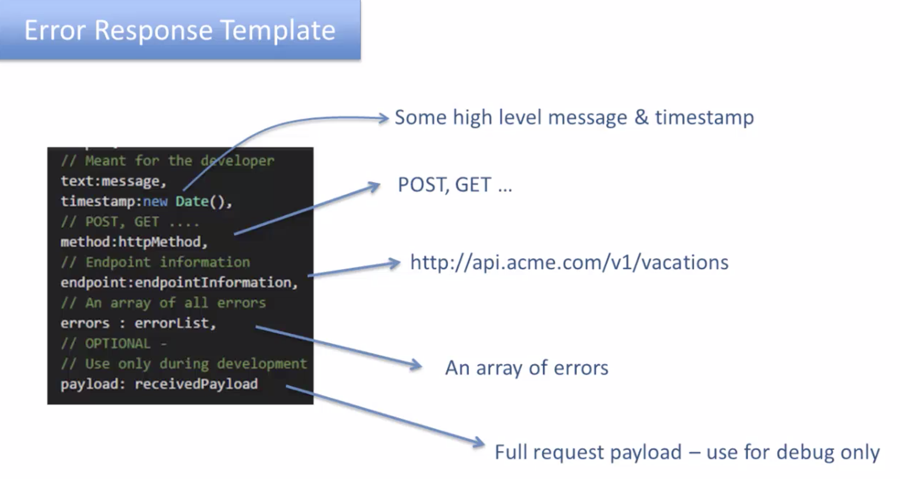
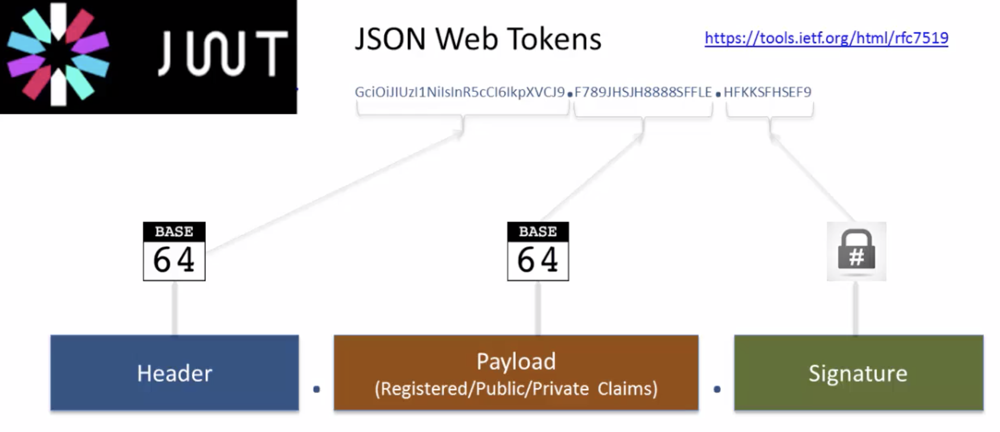
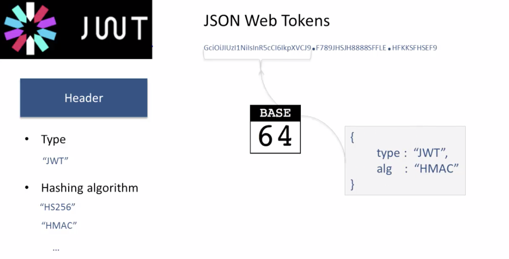
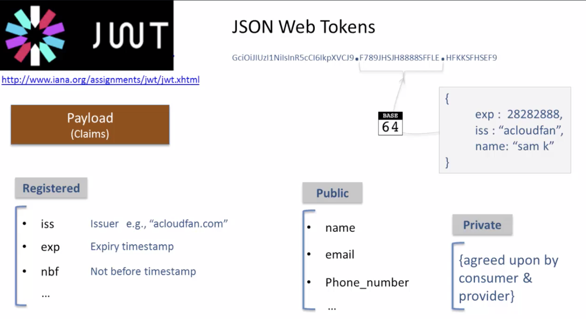
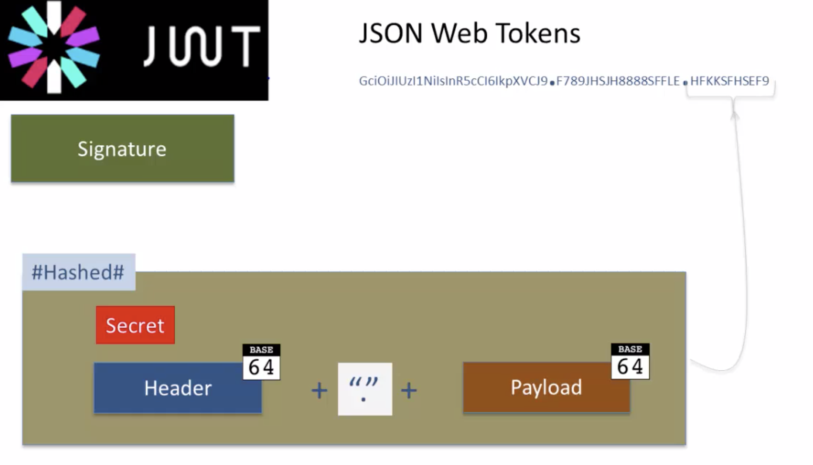

# API Design

TOC:

- 1 Intro
- 2 RESTfull
- 3 URL Guidlines
- 3 API Methods
- 4 Error handling
- 4 Versioning
- 5 Caching


**References:**

- Roy Fielding 'REST' publication in 2000.
- udemy course 'REST API Design, Development & Management by Rajeev Sakhuja'.

## 0 History

    - RPC + xml
    - SOAP + xml

    Start of mobile devices:
        problem:
            - xml = heavy = CPU/Memrory intensive
            - xml = not human elegant-readable.

    Solution

    - REST = Represtational State Transfer
    - JSON = Javascript Simple Object Notation (2002 but popular starts 2006)

## 1 Intro

** API = Application Programm Interface **

What = - user interface to data and systems that is consumed by applications instead of humans. - strict **contract** between provider and consumer - contract: - url definition & versioning - definition of methods (POST,GET,...) + Headers + arguments / datatypes - structure of requests and responses

_Remark: Swagger is todays defacto standard to document this._

## 2 REST

- Communication protocol is defacto 'HTTP' but not mandatory

### 2.1 API types:

    - Public
    - Partner
    - Private

### 2.3 API management:

    - API-Security
    - Access Request
    - Documentation
    - SLA management

### 2.4 6 REST Architectoral Constraints.

Restfull ? = HTTP + JSON -> No = 'REST-like' or 'RESTisch'

RESTfull = 6 REST Architectoral Constraints:

    - Client-Server
    - Uniform Interface             = 'contract'
    - Statelessness                 = server does NOTmanage state of application
    - Caching                       = server controls caching of response via Headers
    - Layered system                = independly managed layers
    - Code On Demand (optional)     = server can send executable code via body in response

### 2.5 API value Chain:

    - API = a Product
    - API is made for the 'App developers':
        Advice:
            - Un-Ambiguous design
            - design for simplicity
            - be clear
            - Stay Consistent
            - ! Document

## API - Endpoint - Resources - Actions

API **Base-url** 'Guidlines:

- no 'www' domain
- keep it simple
- 'api' prefix as subdomain or separate domain cfr:
  - http://api.mycompany.com
  - http://api.mycompany-opendata.com

API **Version** 'Guidlines:

API **Resource** 'Guidlines:

- Always 'Plural' eg /sensor**s**
- do not use 'http verbs' in url eg: http://api.mycompany/getSensor
  - best practice: 'http://api.mycompany.com/sensors/{id}
- nest but max 3 layers

API **Actions**

CRUD = Create-Request-Update-Delete

- POST
- GET
- PUT
- DELETE

- PATCH -> can change 1 attribute of the resource, while PUT updates 'all' attributes of the resource.

How to search?

- /search?query

Examples:

    - GET http://api.sensorcity.com/sensors/search?City=Brugge
    - GET http://api.sensorcity.com/sensors/search?City=Brugge&&type=bikecounter

## 3 API Contract

- http methods
- http status codes
- representation formats

### 3.2 status codes

General subdivision

```
1xx --> Informational
2xx --> Succes
3xx --> Redirection
4xx --> Client Error
5xx --> Server Error

```

KISS principle - Reduce it to max 8 status codes

```
200 OK
201 Created
400 Bad Request
401 Unauthorized
403 Forbidden
404 Not Found
415 Unsupported media
500 Server Error
```

### 3.3 Error Messages

Besides the 'status codes' we also need to give some additional information or hint about what could be causing the problem. Since we can not bluntly pass the internal message from the server or database since this can and will change in case we change the underlaying technology, database etc. Therefore we need to make it agnostic and readable for the app developer (remember!), plus add a hint(s) what could be possible solutions.

Error messages are put in the body.

## Supporting multiple data formats

Today's standard is JSON

2 ways to agree on applied data format

- **as a query parameter**
  - /search?id=445&&format=json -> mostly used + default = json
- **Header**

  - Accept:Application/json -> not common

  ## Error Response Body

  - use API specific error codes eg: error 1002 = 'Missing Temperature field'
  - Deeveloper friendly error description
  - List of all errors.

  

  ## Caching

  Why?

- improves performance
- higher scalability/Throughput

### Factors to take into account:

- Speed of change (cfr stock market)
- Time sensitivity (cfr weather)
- Security (cfr customer data)

Server controls caching!

Design considerations:

- who can cache ? ( client / ISP / Firewall / server / database)
- for how long ?

This is achieved bij the **Cache-Control directives** in the Header (Cache-Control:"....")

see: https://www.w3.org/Protocols/rfc2616/rfc2616-sec14.html (sec 14.9)

### Cache-Control directives:

eg: Cache-Control: "private,max-age=60"

```
no-store    -> NEVER store/cache
no-cache    -> response can be cached under certain conditions with Etag or max-age
private     -> only cache on internal network or client
public      -> everybody can cache.
Etag        -> = hash so intermediate device can see if changed (sends new data) else message 'Not modified'
max-age     -> seconds that data can be cached.

### Best Practices
- Use caching in case of api calls with high data volumes
- use no-cache or private in case of sensitive data
- provide validation tag 'Etag' in case of large responses
- carefully design 'max-age' when used.


```

## Partial Response

## Pagination

- Cursor based : cfr Facebook
  - /friends?Offset=50&Limit=25
  - response = data + (pagination) metadata

## 5 Security

### Overview

- Basic Athentication
- Token based
- API key & secret
- OAuth

### 5.1 Basic Authentication

- HTTP**S** is mandatory, else username/password in the clear (cfr Man in the middle attack)
- via Header Field:
  - key ='Authorization
  - value = 'Basic + Base64(username:password)'
- Pro = simple
- Con =
  - need auth with EVERY api call since REST is stateless
  - need to be 'hardcoded' in mobile app. -> not suited

### 5.2 Token based

Today JWT = JSON Web Token (RFC 7519) -> accepted token approch on www http://www.jwt.io









### 5.3 API key & secret

Like "user/pswd" but NOT the same -> here user = machine !!

- API-key = long string -> identifies api consumer
- API-secret = proves identity (cfr pswd)

### 5.4 OAuth2.0

**Defacto standard on internet**

= Flexible Authorazation Framework (RFC6749)

** 5 Grant Types**

- Authorization Scope Grant
- Implicit Grant
- Resource Owner Credentials Grant --> Bad = credentials are shared with other app !!
- Client Credentials Grant
- Refresh Token Grant

## 6 Security

reference: http://www.owasp.org (Open Web Application Security Project)

**4 types of functional attacks**

- sql injection
- Fuzzing -> input random data to understand logic and weaknesses
- CORS -> tries to execute roque scripts via CORS
- session/token hijacking

## API Specification

2 approches:

- Contract First = best practise (first the spec than the code)
- Contract Last (First Code then spec/documentation)

API Specification standards:

- Swagger = defacto standard
- WADL
- RAML
- apiblueprint
- apiary

PS: Swagger

- (2010) --> since 2015 Swagger = OPENAPI specification :version 2.0
- OPENAPI = part of Linux Foundation.
- uses prefered = YML(JSON superset ) or JSON
- YAML:

  - mostly uses for configuration files
  - indentetion instead of {}
  - no "" and ',' for key:value pairs
  - editor: http://editor.swagger.io

Tools for Swagger:

- Developer documentation
- Client Code generation
- Proxy generation
- Mocks
